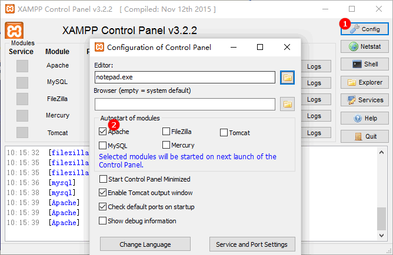

# xampp-windows-cli

Some assistant utils for XAMPP/Windows.

It provides a convenience to update apache/conf/extra/httpd-vhosts.conf or
set up a temporary vhost for current working directory.
Check "config-sample/httpd-temp.conf" for details.

## Usage

First install:

- [Node.js 5.0+](https://nodejs.org/)
- [XAMPP](https://www.apachefriends.org/download.html)

Allow xampp installer to launch xampp-control.exe at the last installation step.
It's better to let Apache/MySQL autostart when launching xampp-control.exe.



Now run the following commands in the command prompt:

``` bat
npm install -g xampp-windows-cli
xa --help
cd /d %USERPROFILE%/xampp
copy config-sample/config.js
rem edit config.js

rem here suppose 7.0 is used
mkdir 7.0
cd 7.0
rem edit the config files, then run the command
xa set

xa a
```

## License

MIT (c) Ivan Yan
